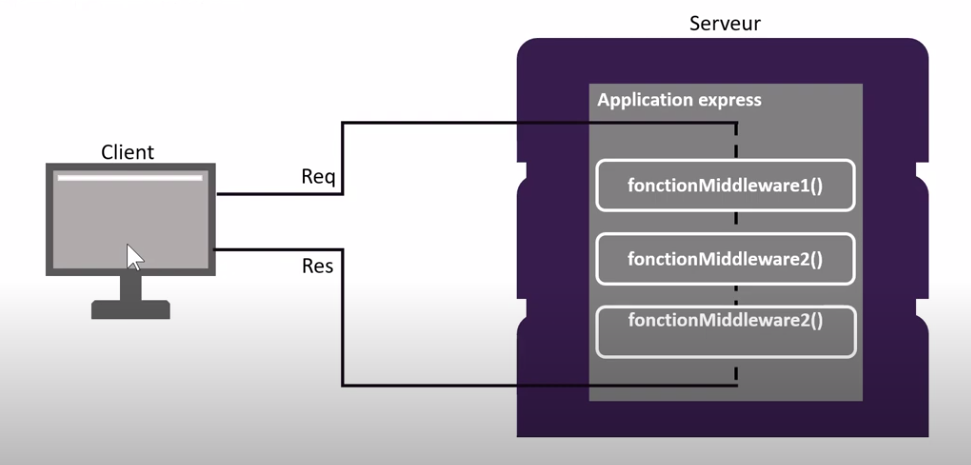

# Serveur node

## Création de notre premier serveur

Pour créer notre serveur, Node nous permet d'accéder au module ‘http’. Donc comme nous l’avons
vu précédemment (node.js), pour importer un module de node il faut utiliser le mot clé **require**.
Commençons par créer un fichier que nous allons nommé “nodeServer.js” puis importons le module ‘http’ que nous stockerons dans une constante du même nom :

  const http = require("http");
Cette constante nous donne accès à la méthode **createServer** de **l' objet http**. Cette méthode,
comme son nom l'indique, nous permet de créer notre serveur. Elle prend en paramètre une fonction callback, ce sera une fonction fléchée. 
Pour l’instant nous demanderons à ce callback de juste
afficher un message de succès dans la console :

  http.createServer(
    () => console.log("Server created succesfully");
  );
Pour pouvoir s'exécuter correctement ce callback a besoin de deux paramètres, l'objet requête et
l’objet réponse. Nous allons donc les ajouter et stocker notre méthode “createServer” dans une
constante :

   http.createServer(
    (Requeste, Response) => console.log("Server created succesfully");
  );
A ce stade là, en exécutant ce programme nous aurons un serveur qui se crée et s'exécute en arrière plan sur notre machine, mais qui pour l’instant est incapable d’ écouter les requêtes. Le verbe écouter en anglais se dit listen, nous allons utiliser le méthode du même nom qui prendra trois
paramètres, le port, le domaine et une fonction callback :

  server.listen(8080, "localhost", ()=>
  console.log('server listening on port 80808");
  );
Puis nous nous rendons sur l' URL **localhost:8080**.
La console affiche:
Server listenong on port 8080
server created succesfully
GET
->Nous sommes parvenu à récupèrer la méthode **GET**.
Nous pouvons aussi récupèrer l' URL courante grâce à **Request.url**, l'argument url de l' obejt Request nous renverra l' url sans le nom de domaine.

Exemple:
Si nous nous situons sur l'index, la console affiche /, donc si nous rajoutons dans l' url home, la console affichera:
/home.
Cela est important car elles vont nous permettre de dire au serveur quelle réponse envoyer au client selon l' url ou selon la reuête HTTP, voire même les deux.

Exemple:

  const http = require("http");
  const serveur = http.createServer((Request, Response)=>{
    console.log("server created succesfully");
    if(Request.url === "/" || Request.url === "/home"){
      console.log("vous êtes sur la home page);
    };
  })
  

  const http = require("http");
  const serveur = http.createServer((Request, Response)=>{
    console.log("server created succesfully");
    if(Request.url === "/" || Request.method === "GET"){
      console.log("vous êtes sur la home page);
    };
  })
  ->Dans cet exemple, nous vérifions que la méthode utilisée est bien GET.

## Module fileSystem

Comme nous l’ avons vu dans le chapitre sur les modules (node.js) le module de node “fs” est un module qui contient plusieurs méthodes asynchrone dont il faut écrire le nom suivi de Sync pour
les rendre synchrone. 
Dans le chapitre précédent nous avons écrit directement depuis la méthode createServer ce qui, si nous avions beaucoup de pages avec elles-même beaucoup de contenu, rendrait l’application difficile à développer et surtout à maintenir tant le code serait illisible. C’est pour cela que nous allons utiliser le module file system pour pouvoir gérer nos fichiers, nos dossiers en
les lisant ou en écrivant dessus. Voyons comment utiliser le module “fs”.

Commençons par créer un nouveau fichier que nous appellerons “gestionFichier.js”, puis importons
dans celui-ci le module ‘fs’:

  const fs= require("fs");

Maintenant essayons de créer un dossier depuis celui-ci. Pour cela nous utilisons la méthode ‘mkdir’ qui prend deux paramètres, le nom du dossier que nous souhaitons créer et une fonction callback:

  fs.mkdir('./monDossier', ()=>{
    console.log("dossier créé");
  });
En exécutant ce code depuis la console on s'aperçoit que le dossier est bien créé et que la console affiche le message ‘dossier créé’. Néanmoins la fonction callback est destiné à la gestion des erreurs, nous allons donc lui passer en paramètre l’objet erreur:

  fs.mkdir('./monDossier', (Erreur)=>{
    if(Erreur){
      console.log(Erreur);
    }else{
      console.log("dossier créé");
    }   
  });

Supprimons le dossier et ré-essayons d'exécuter le code. Sa marche encore ! Bien maintenant nous voudrions que le dossier ne se créer seulement si celui-ci n’existe pas, pour cela nous allon utiliser la méthode **existsSync**:

   if(fs.existSync('./monDosier')){
    console.log('le dossier existe déjà);
   }else{
     fs.mkdir('./monDossier', (Erreur)=>{
      if(Erreur){
        console.log(Erreur);
      }else{
        console.log("dossier créé");
      }   
    });
  }

Lorsque nous exécutons la console me dit ‘le dossier existe déjà’, c’est parfait jusqu’ici tout va bien.
Si nous voulions que si il existe déjà celui-ci soit supprimer alors nous utiliserons la méthode **rmdir**:

  if(fs.existSync('./monDosier')){
    fs.rmdir('./monDossier', (Erreur)=>{
      if(Erreur){
        console.log(Erreur);
      }else{
        console.log("dossier supprimé");
      }   
    });
   }else{
     fs.mkdir('./monDossier', (Erreur)=>{
      if(Erreur){
        console.log(Erreur);
      }else{
        console.log("dossier créé");
      }   
    });
  }

- Pour créer un fichier: méthode **writeFile**. Elle prend trois paramètres: nom du fichier, avec son chemin, le contenu, une fonction callback. Attention, si je modifie le contenu, le précédent est écrasé.
- Pour lire le contenu: **readFile**.
Elle prend deux paramètres: chemin du fichier, et fonction callback.
**Attention, renvoie le contenu en binaire. Pour le rendre lisible, il faut le convertir en chaîne de caractères .toString()**.
- Pour supprimer un fichier: méthode **unlink**.

## NPM Node Package Manager

Outil, programme gérant les bibliothèques de programmation JS pour Node.js.
Il est le gestionnaire de paquets par défaut pour l'environnement d' éxecution JS Node.js de Node.js.
Il se compise d' un client en ligne de commande, également appelé npm, et d'une base de données en ligne de paquets publices et privés payants, appelée: registre npm.

Lorsque l'on installe node, l'on installe également npm.
Pour initialiser un projet avec npm il faut:
- npm init. La console me pose des questions
(repondre entrée ou npm init -y)
->apparition fichier package.json:
chosisir page principale dans package main ou page projet.js,
author anneso.

Le nom, la version, la description, le point d’entrée de l’application, le script à exécuter pour lancer
l’application, l’auteur et la licence. Si nous ajoutons des bibliothèques tierce à utilisées, celles-ci seront aussi contenues dans les informations du package.json dans l’attribut “dependencies”. Par
exemple, vous vous souvenez que à chaque changement que nous faisons dans le code il fallait
redémarrer le serveur avec Ctrl +c pour le quitter puis “node nodeServer” dans la console pour le
relancer. Et bien il existe un package pour ça qui s'appelle **Nodemon**.

## Nodemon

Watcher pour automatiser:
->surveille changement et évite relancer serveur

- npm i nodemon (npm i pour installer chauqe bibliothèque souhaitée):
ajout package-lock et node module, et dans json, nodemon apparaît liste des dépendances (Il y a aussi des dépendances fontawesome par exemple).
**Attention clone git -> retirer node modules: gitignore .gitignore /node_modules pour push!**

Pour lancer le script:

- nodemon nodeServer,
- dans package json: scripts/start "nodemon nodeServer",
- npm start.

{
  "name": "serveur_node",
  "version": "1.0.0",
  "description": "",
  "main": "nodeServer.js",
  "scripts": {
    "start": "nodemon nodeServer",
    "test": "echo \"Error: no test specified\" && exit 1"
  },
  "keywords": [],
  "author": "AnneSo",
  "license": "ISC",
  "dependencies": {
    "nodemon": "^2.0.22"
  }
}

## Autres packages:

### Express

Permet de fournir des outils robustes pour serveur http
solution pour les appli à page unique,hybrides, ...

Ici, création **single page application** (SPA)
avec rendu différents, un seul script, il n' y a que la valeur de la var change seulement.

-npm i express
Il apparaîtra ainsi dans la  liste des dépendances package.json.

faire get pour que si on est sur l'url comme ressource/ redirige vers /home

**middleware**:

Principe du middleware use: si au début ne va pas chercher ailleurs, boucle infinie. Dès qu'il éxécute ne va pas à la suivante,pour dire par défaut tu fais ça mais continue:
il faut ajouter **next**.

Ajout img index erreur404:
https://www.donskytech.com/how-to-serve-static-files-in-node-js-and-express-server/

Il faut donc créer un dossier public pour les ressources distantes.

Autre midleware tiers:
npm i **morgan**.

Voir nav pour naviguer entre toutes les pages.